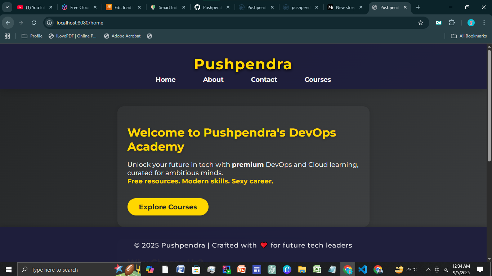

# Go Web Application

This is a simple website written in Golang. It uses the `net/http` package to serve HTTP requests.

## Running the server

To run the server, execute the following command:

```bash
go run main.go
```

The server will start on port 8080. You can access it by navigating to `http://localhost:8080/courses` in your web browser.

## Looks like this




# Running application locally 
```bash
  go mod tidy
  go run main.go
```


# Creating docker file - docker image - docker push

- using multistage build file 

- make docker image 
- docker build -t go-web-app .

- check if the docker container working fine or not
    - docker run -p 8080:8080 -it go-web-app

* pushing docker image
- doing tagging for docker image : docker tag go-web-app <docker_username>/go-web-app:v1
- pushing the image to docker hub : docker push <docker_username>/go-web-app:v1


# Creating k8s manifests files

- mkdir k8s/manifests
- deployment.yaml , service.yaml , ingress.yaml


# EKS CLUSTER - Testing our application

- prerequsites
- kubectl
- eksctl
- aws cli - configure

* create cluster : eksctl create cluster --name demo-cluster --region ap-south-1   : it will take time 
* delete cluster : eksctl delete cluster --name demo-cluster --region ap-south-1
  
- Apply all the manifests files to the cluster
 ```bash
   kubectl apply -f k8s/manifests/deployment.yaml
   kubectl apply -f k8s/manifests/service.yaml
   kubectl apply -f k8s/manifests/ingress.yaml
```
# Accessing Our application : NodePort

- you can't access application
   - kubectl get ing - no public ip
   - ingress controller - it will assign public address to ingress resource
  
- NodePort 
   - kubectl get svc
   - kubectl get nodes - wide  
   - `http://ip:port`
  

# ERROR - ImagePullBackOff

- update tag             / keep the tag v1 everywere
- security groups        / allow port
- 404 page not found -   / home


# INGRESS CONTROLLER : ingress <-👀--> LB

```bash
kubectl apply -f https://raw.githubusercontent.com/kubernetes/ingress-nginx/controller-v1.11.1/deploy/static/provider/aws/deploy.yaml

```


- To check weather it is installed or not use
-  kubectl get pods -n ingress-nginx

****
- Ingress will have an address now - loadbalancer address
- Still can't accessed 


# DNS Mapping 


nslookup lb_dns -- > you will get ip 

ip <--Map - -> ingress host - go-web-app.local

- for Linux
   - sudo vim /etc/hosts
   - Now add the ip to domain
  
- for windows 
   - Editing host file
   - search "Notepad" → right-click → Run as administrator
   - open : C:\Windows\System32\drivers\etc\hosts
   -  <LOADBALANCER-EXTERNAL-IP>   go-web-app.local


# Still Not Accessable - ? 

- may be because - of service of nodeport ?


# HELM  :  Creating helm charts for our application

- Helm - package manager , no need to have different manifest for different environment
- No need to apply every yaml file - one click go


- Create a helm folder in root directory
- Run command : helm create go-web-app-chart

- In templates folder ->  rm -rf *
- copy the manifest files  - > templates folder 
- variablias things 

* Install helm on k8s cluster : delete the previous yaml files

- helm install go-web-app ./go-web-app-chart 
- helm uninstall go-web-app


# CI / CD 

# CI -  github action 

- create a folder in the root directory
- .github/workflows/ci.yaml
  
- In ci.yaml > write about the pipeline 
- build & test
- static code analysis
- push docker image
- Update helm
  -update values.yaml


-- > variablize docker username , docker token  > in ci.yaml
--- get it from the github secrets 

- When you push any change to git repo ci pipeline will automaticlly get run


# CD - argo cd


- kubectl create namespace argocd
- kubectl apply -n argocd -f https://raw.githubusercontent.com/argoproj/argo-cd/stable/manifests/install.yaml

- kubectl patch svc argocd-server -n argocd -p '{"spec": {"type": "LoadBalancer"}}'
  
- for windows
- kubectl patch svc argocd-server -n argocd -p '{\"spec\": {\"type\": \"LoadBalancer\"}}'


- kubectl get svc argocd-server -n argocd


- patch the argo cd for windows
- kubectl patch svc argocd-server -n argocd -p "{\"spec\": {\"type\": \"LoadBalancer\"}}"

- kubectl get svc -n argocd                  // access the argo cd 


- default username : admin
- default password : kubectl get secret argocd-initial-admin-secret -n argocd -o jsonpath="{.data.password}" | base64 -d


🙏 Acknowledgment
A big thank you to Abhishek Veeramalla, whose tutorial guided me through this project and made learning smoother.